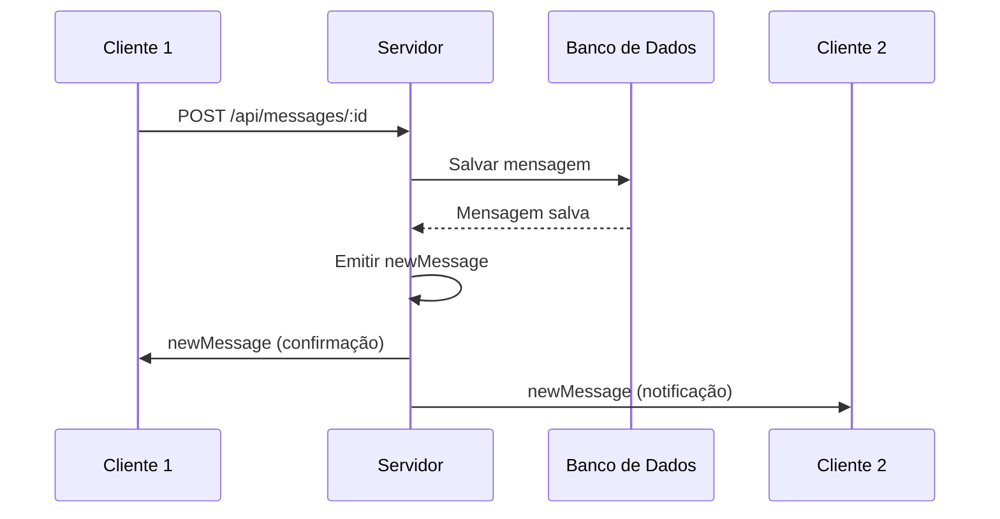
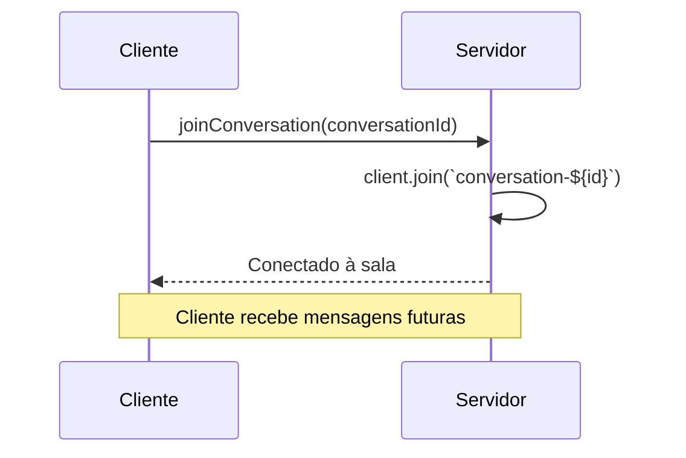

# WebSocket Events

Documentação completa dos eventos WebSocket do ChatBridge.

## Conexão

**URL**: `ws://localhost:3000`
**Protocolo**: Socket.io
**CORS**: Configurado para desenvolvimento

### Estabelecimento de Conexão

```javascript
import io from 'socket.io-client';

const socket = io('http://localhost:3000', {
  transports: ['websocket'],
  autoConnect: true
});
```

---

## Eventos Cliente → Servidor

### joinConversation

**Descrição**: Cliente entra na sala de uma conversa para receber mensagens em tempo real

**Payload**:
```typescript
conversationId: string
```

**Exemplo**:
```javascript
socket.emit('joinConversation', '123e4567-e89b-12d3-a456-426614174000');
```

**Processo no Servidor**:
1. Cliente é adicionado à sala `conversation-{conversationId}`
2. Log da conexão é registrado
3. Cliente recebe mensagens futuras desta conversa

**Uso no Frontend**:
```typescript
useEffect(() => {
  if (conversationId) {
    socket.emit('joinConversation', conversationId);
  }
}, [conversationId]);
```

---

## Eventos Servidor → Cliente

### newMessage

**Descrição**: Nova mensagem foi enviada na conversa

**Payload**:
```typescript
{
  id: string;
  text: string;
  createdAt: Date;
  sender: {
    id: string;
    email: string;
  };
  conversation: {
    id: string;
  };
}
```

**Exemplo**:
```javascript
socket.on('newMessage', (message) => {
  console.log('Nova mensagem:', message);
  // Atualizar interface com nova mensagem
});
```

**Processo no Servidor**:
1. Mensagem é salva no banco de dados
2. Evento é emitido para todos os clientes na sala `conversation-{id}`
3. Clientes recebem mensagem em tempo real

**Uso no Frontend**:
```typescript
useEffect(() => {
  socket.on('newMessage', (newMessage) => {
    if (newMessage.conversation.id === conversationId) {
      setMessages(prev => [...prev, newMessage]);
    }
  });

  return () => {
    socket.off('newMessage');
  };
}, [conversationId]);
```

---

## Salas (Rooms)

### Estrutura de Salas

**Formato**: `conversation-{conversationId}`

**Exemplo**: `conversation-123e4567-e89b-12d3-a456-426614174000`

### Gerenciamento de Salas

#### Entrar na Sala
```javascript
// Cliente emite evento
socket.emit('joinConversation', conversationId);

// Servidor adiciona à sala
client.join(`conversation-${conversationId}`);
```

#### Sair da Sala
```javascript
// Cliente desconecta
socket.disconnect();

// Servidor remove automaticamente de todas as salas
```

#### Emitir para Sala
```javascript
// Servidor emite para todos na sala
this.server.to(`conversation-${conversationId}`).emit('newMessage', message);
```

---

## Fluxo de Mensagens

### 1. Envio de Mensagem



### 2. Conexão à Conversa



---

## Implementação no Backend

### MessagesGateway

**Localização**: `src/messages/message.gateway.ts`

```typescript
@WebSocketGateway({
  cors: {
    origin: '*',
  },
})
@Injectable()
export class MessagesGateway {
  @WebSocketServer()
  server: Server

  @SubscribeMessage('joinConversation')
  handleJoinConversation(
    @MessageBody() conversationId: string,
    @ConnectedSocket() client: Socket,
  ) {
    client.join(`conversation-${conversationId}`)
    console.log(`Cliente ${client.id} entrou na sala conversation-${conversationId}`)
  }

  emitNewMessage(message: any) {
    this.server.to(`conversation-${message.conversation.id}`).emit('newMessage', message)
  }
}
```

### Integração com MessagesService

```typescript
async createMessage(text: string, sender: User, conversation: Conversation): Promise<Message> {
  const message = this.messagesRepo.create({ text, sender, conversation })
  const saved = await this.messagesRepo.save(message)
  const result = await this.messagesRepo.findOne({
    where: { id: saved.id },
    relations: ['sender', 'conversation'],
  })
  
  // Emitir via WebSocket
  this.gateway.emitNewMessage(result!)
  return result!
}
```

---

## Implementação no Frontend

### Hook de WebSocket

```typescript
import { useEffect, useRef } from 'react';
import io from 'socket.io-client';

export const useWebSocket = (conversationId: string) => {
  const socketRef = useRef<any>(null);

  useEffect(() => {
    if (!conversationId) return;

    // Conectar
    socketRef.current = io('http://localhost:3000');
    
    // Entrar na sala
    socketRef.current.emit('joinConversation', conversationId);

    // Escutar mensagens
    socketRef.current.on('newMessage', (message) => {
      // Processar nova mensagem
      console.log('Nova mensagem:', message);
    });

    // Cleanup
    return () => {
      socketRef.current?.disconnect();
    };
  }, [conversationId]);

  return socketRef.current;
};
```

### Uso no Componente de Chat

```typescript
export default function ChatRoom() {
  const { id: conversationId } = useParams();
  const [messages, setMessages] = useState<Message[]>([]);
  const socket = useWebSocket(conversationId as string);

  useEffect(() => {
    if (socket) {
      socket.on('newMessage', (newMessage) => {
        if (newMessage.conversation.id === conversationId) {
          setMessages(prev => [...prev, newMessage]);
        }
      });
    }
  }, [socket, conversationId]);

  const handleSend = async (text: string) => {
    // Enviar via API
    const response = await axios.post(`/messages/${conversationId}`, {
      senderId: user.id,
      text,
    });

    // Mensagem será recebida via WebSocket
    // Não precisa adicionar manualmente ao estado
  };
}
```

---

## Configuração

### Backend (NestJS)

```typescript
// main.ts
const app = await NestFactory.create(AppModule);
app.enableCors({
  origin: true,
  methods: ['GET', 'POST', 'PUT', 'DELETE', 'OPTIONS'],
  allowedHeaders: ['Content-Type', 'Authorization'],
  credentials: true,
});
```

### Frontend (Next.js)

```typescript
// socket.ts
import io from 'socket.io-client';

export const socket = io('http://localhost:3000', {
  transports: ['websocket'],
  autoConnect: true,
});
```

---

## Tratamento de Erros

### Conexão Perdida

```typescript
socket.on('disconnect', (reason) => {
  console.log('Desconectado:', reason);
  // Tentar reconectar
  socket.connect();
});

socket.on('connect_error', (error) => {
  console.error('Erro de conexão:', error);
  // Mostrar mensagem de erro para o usuário
});
```

### Reconexão Automática

```typescript
socket.on('reconnect', (attemptNumber) => {
  console.log('Reconectado após', attemptNumber, 'tentativas');
  // Reentrar na sala da conversa
  socket.emit('joinConversation', conversationId);
});
```

---

## Monitoramento

### Logs do Servidor

```typescript
@SubscribeMessage('joinConversation')
handleJoinConversation(conversationId: string, client: Socket) {
  client.join(`conversation-${conversationId}`);
  console.log(`Cliente ${client.id} entrou na sala conversation-${conversationId}`);
}
```

### Métricas

```typescript
// Contar clientes conectados
const room = this.server.sockets.adapter.rooms.get(`conversation-${conversationId}`);
const clientCount = room ? room.size : 0;
console.log(`Clientes na conversa ${conversationId}: ${clientCount}`);
```

---

## Segurança

### Validação de Conversa

```typescript
@SubscribeMessage('joinConversation')
async handleJoinConversation(conversationId: string, client: Socket) {
  // Verificar se usuário tem acesso à conversa
  const hasAccess = await this.checkUserAccess(client.userId, conversationId);
  
  if (hasAccess) {
    client.join(`conversation-${conversationId}`);
  } else {
    client.emit('error', 'Acesso negado à conversa');
  }
}
```

### Rate Limiting

```typescript
// Limitar mensagens por minuto
const messageCount = await this.redis.get(`messages:${client.userId}:${Date.now()}`);
if (messageCount > 60) {
  client.emit('error', 'Muitas mensagens. Tente novamente em 1 minuto.');
  return;
}
```
